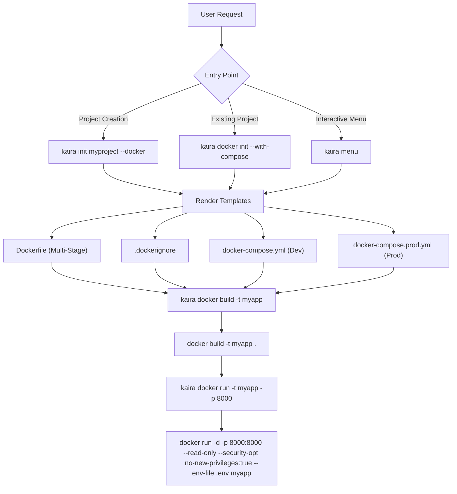

# Kaira ⚡ — Docker Service Status & Workflow

> **Overview:** This document provides a complete technical reference for the Docker service within **Kaira** (formerly DevFlow). It covers the current operational status, architecture, CLI commands, template generation, security mechanisms, multi-database compose provisioning, and CI/CD pipelines.

---

## 📌 Current Status

| Metric / Aspect | Details |
|---|---|
| **Service Status** | 🟢 **Stable & Fully Functional** |
| **CLI Namespace** | `kaira docker` |
| **Primary Code File** | [`kaira/commands/docker_cmd.py`](file:///c:/Users/Asus/Documents/scripts/DevFlow/kaira/commands/docker_cmd.py) |
| **Template Location** | [`kaira/templates/`](file:///c:/Users/Asus/Documents/scripts/DevFlow/kaira/templates) |
| **Test Coverage** | Verified in [`tests/test_phase2.py`](file:///c:/Users/Asus/Documents/scripts/DevFlow/tests/test_phase2.py) |
| **Base Docker Image** | `python:3.11-slim` |
| **Supported Databases** | PostgreSQL, MySQL, MongoDB, SQLite |

**Summary:** The Docker service in Kaira is fully implemented, self-contained, and production-ready. It allows users to scaffold hardened Docker configurations during project creation (`kaira init`) or on-demand via the dedicated `kaira docker` command group.

---

## 🔄 End-to-End Workflow

The Docker workflow in Kaira operates across three distinct stages: **Initialization**, **Building**, and **Execution**.



### 1. Initialization Workflow
When scaffolding a project or Docker environment:
- **Automatic (during project creation):**
  ```bash
  kaira init myproject --db postgresql --auth jwt --docker
  ```
  Generates `Dockerfile`, `.dockerignore`, `docker-compose.yml`, and `docker-compose.prod.yml` in the project root.

- **On-Demand (existing project):**
  ```bash
  kaira docker init --with-compose --force
  ```
  Uses [`kaira.core.detector.write_with_check`](file:///c:/Users/Asus/Documents/scripts/DevFlow/kaira/core/detector.py) to safely write or overwrite configuration files without breaking existing code.

### 2. Container Build Workflow
```bash
kaira docker build --tag my-app
```
Executes `docker build -t my-app .` under the hood via standard Python subprocess handlers, verifying image assembly from the local Jinja2-rendered `Dockerfile`.

### 3. Secure Container Execution Workflow
```bash
kaira docker run --tag my-app --port 8000
```
Launches a container instance with enforced security constraints (read-only root filesystem, no privilege escalation, and `.env` secret injection).

---

## 🛠 CLI Command Reference

The [`docker_app`](file:///c:/Users/Asus/Documents/scripts/DevFlow/kaira/commands/docker_cmd.py#L19) command group is registered in [`kaira/main.py`](file:///c:/Users/Asus/Documents/scripts/DevFlow/kaira/main.py#L126).

### `kaira docker init`
Scaffolds Docker configuration files.

- **Flags:**
  - `--with-compose`: Also generates development and production `docker-compose` files.
  - `--force`: Overwrites pre-existing Docker configuration files.
- **Outputs:** `Dockerfile`, `.dockerignore`, `docker-compose.yml`, `docker-compose.prod.yml`.

### `kaira docker build`
Builds the application container image.

- **Flags:**
  - `-t, --tag`: Specify image tag name (Default: `kaira-app`).

### `kaira docker run`
Runs the application container in detached mode with security flags.

- **Flags:**
  - `-t, --tag`: Specify container image tag to run (Default: `kaira-app`).
  - `-p, --port`: Map host port to container port 8000 (Default: `8000`).

---

## 📄 Deep Dive: Scaffolding Templates

All template files are located in [`kaira/templates/`](file:///c:/Users/Asus/Documents/scripts/DevFlow/kaira/templates).

### 1. Multi-Stage Dockerfile ([`docker_dockerfile.j2`](file:///c:/Users/Asus/Documents/scripts/DevFlow/kaira/templates/docker_dockerfile.j2))
Kaira enforces a 2-stage build pipeline for minimal image footprint and enhanced security:

```dockerfile
# Stage 1: Builder
FROM python:3.11-slim AS builder
WORKDIR /app
COPY requirements.txt .
RUN pip install --no-cache-dir -r requirements.txt

# Stage 2: Runtime
FROM python:3.11-slim
WORKDIR /app
COPY --from=builder /usr/local/lib/python3.11/site-packages /usr/local/lib/python3.11/site-packages
COPY --from=builder /usr/local/bin /usr/local/bin
COPY . .

RUN adduser --disabled-password --gecos '' appuser \
    && chown -R appuser:appuser /app

USER appuser
EXPOSE 8000
CMD ["uvicorn", "main:app", "--host", "0.0.0.0", "--port", "8000"]
```

### 2. Dynamic Development Compose ([`docker_compose.j2`](file:///c:/Users/Asus/Documents/scripts/DevFlow/kaira/templates/docker_compose.j2))
Kaira dynamically injects database container configurations based on the selected `db_type`:

| `db_type` | Image | Default Port | Storage Volume |
|---|---|---|---|
| **PostgreSQL** | `postgres:15-alpine` | `5432` | `pgdata` |
| **MySQL** | `mysql:8.0` | `3306` | `mysqldata` |
| **MongoDB** | `mongo:7` | `27017` | `mongodata` |
| **SQLite** | *(None required)* | N/A | File-based |

### 3. Production Compose ([`docker_compose_prod.j2`](file:///c:/Users/Asus/Documents/scripts/DevFlow/kaira/templates/docker_compose_prod.j2))
Configured with production-grade reliability mechanisms:
- **Resource Limits:** Restricts CPU (`0.5`) and RAM (`512M`).
- **Restart Policy:** `restart: always`.
- **Health Checks:** Container health monitored via `curl -f http://localhost:8000/health`.
- **Service Dependency Control:** Application startup waits for database health confirmation (`condition: service_healthy`).

---

## 🔒 Security & Runtime Hardening

Kaira's Docker implementation adheres to container security best practices:

1. **Non-Root Execution:** Containers run under the unprivileged `appuser` user rather than `root`.
2. **Read-Only Root Filesystem:** Execution uses `--read-only` to prevent unauthorized runtime file modifications.
3. **Privilege Escalation Prevention:** Enforces `--security-opt no-new-privileges:true`.
4. **Environment Isolation:** Secrets are kept out of images by mounting `.env` via `--env-file .env`.
5. **Context Cleanliness:** `.dockerignore` excludes git history, virtual environments, cache files, and credentials.

---

## 🌐 CI/CD & Cloud Integration

Docker configurations generated by Kaira seamlessly integrate into deployment pipelines:

- **GitHub Actions (`ci_github_deploy.yml.j2`):** Automated container build & push using `docker/login-action` and `docker/build-push-action`.
- **GitLab CI (`ci_gitlab.yml.j2`):** Automated build using `docker:24` with Docker-in-Docker (`dind`).
- **Bitbucket Pipelines (`ci_bitbucket.yml.j2`):** Container pipeline steps configured out of the box.
- **Fly.io Deployment (`deploy_fly.toml.j2`):** Direct deployment using generated `Dockerfile`.

---

## 🧪 Verification & Testing

The Docker service commands and template generators are tested in the test suite:

- Test file: [`tests/test_phase2.py`](file:///c:/Users/Asus/Documents/scripts/DevFlow/tests/test_phase2.py)
- Command: `pytest tests/test_phase2.py`
