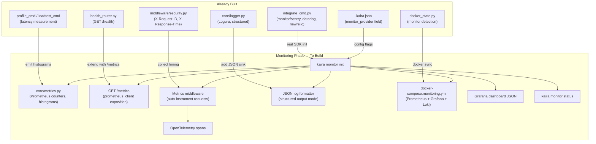

# Kaira ⚡ — Monitoring Status & Gap Analysis

> **Purpose:** Snapshot of every monitoring-adjacent feature that exists in Kaira today, scored by readiness, so the next phase has a clear starting surface to build on.
>
> **Date:** 2026-08-12 · **Codebase:** v0.1.0 (Phase 8 complete)

---

## 📌 Executive Summary

Kaira currently has **no dedicated monitoring subsystem**. However, several features already provide partial observability coverage — structured logging, a `/health` endpoint, request correlation IDs, third-party monitor integration stubs (Sentry/Datadog/New Relic), and Docker health checks. These are scattered across different phases and not unified under a single `kaira monitor` surface.

| Area | Current State | Readiness |
|---|---|---|
| Structured Logging | ✅ Complete (Phase 8) | Production-ready |
| `/health` Endpoint | ✅ Complete (Phase 4) | Production-ready |
| Request Correlation IDs | ✅ Complete (Phase 8) | Production-ready |
| Response Timing Header | ✅ Complete (Phase 8) | Production-ready |
| Error Envelope / Contract | ✅ Complete (Phase 8) | Production-ready |
| Third-Party Monitor Integration | ⚠️ Stub only (Phase 4) | Env wiring only |
| Prometheus / Metrics Endpoint | ❌ Missing | Not started |
| OpenTelemetry Tracing | ❌ Missing | Not started |
| Grafana Dashboard Templates | ❌ Missing | Not started |
| Alerting Rules | ❌ Missing | Not started |
| Application Metrics Collection | ❌ Missing | Not started |
| `kaira monitor` CLI Group | ❌ Missing | Not started |
| Docker Compose Observability Stack | ❌ Missing | Not started |
| Log Aggregation (file sinks, JSON) | ❌ Missing | Not started |

---

## ✅ What Already Exists

### 1. Structured Logging — [`logger.py.j2`](file:///c:/Users/Asus/Documents/scripts/DevFlow/kaira/templates/logger.py.j2)

**Phase:** 8 · **Status:** 🟢 Production-ready

The generated `core/logger.py` provides:
- **Loguru-based** single-sink terminal logger
- **One-line-per-request** format: `HH:MM:SS  LEVEL  METHOD  STATUS  PATH  ·  DURATION`
- **Colour as signal** — status codes and slow durations are tinted (≥500ms amber, ≥1500ms red)
- **Multi-part event blocks** via `detail()` for aligned continuation lines
- **Intercept handler** unifying uvicorn, SQLAlchemy, watchfiles, and httpx stdlib loggers into Loguru
- **Environment controls:** `KAIRA_LOG_LEVEL`, `KAIRA_ACCESS_LOG`, `KAIRA_DIAGNOSE`, `NO_COLOR` / `FORCE_COLOR`

**What's missing for monitoring:**
- No JSON/structured output mode (logs are human-readable only — unusable by log aggregators like Loki, ELK, CloudWatch)
- No log file sink — stdout only
- No log rotation configuration
- No correlation ID propagation to external services

---

### 2. `/health` Endpoint — [`health_router.py.j2`](file:///c:/Users/Asus/Documents/scripts/DevFlow/kaira/templates/health_router.py.j2)

**Phase:** 4 · **Status:** 🟢 Production-ready · **CLI:** `kaira health-endpoint generate`

The generated health router provides:
- `GET /health` — unauthenticated, rate-limited at 300/min
- Reports `status`, `database.engine`, `database.name`, `database.mode`
- Conditionally includes `cache` status if cache is initialised
- Never leaks DSN, secrets, or stack traces

**What's missing for monitoring:**
- No uptime or startup timestamp
- No version/commit SHA in response
- No dependency health checks beyond database and cache (e.g., Celery broker, search engine, external APIs)
- No readiness vs. liveness probe distinction (Kubernetes pattern)
- No `/metrics` companion endpoint

---

### 3. Request Correlation & Timing — [`security_middleware.py.j2`](file:///c:/Users/Asus/Documents/scripts/DevFlow/kaira/templates/security_middleware.py.j2)

**Phase:** 8 · **Status:** 🟢 Production-ready

The security middleware provides:
- `X-Request-ID` header on every response (UUID-based correlation ID)
- `X-Response-Time` header with millisecond precision
- Request ID appears in error responses and terminal logs
- Configurable skip paths via `KAIRA_LOG_SKIP_PATHS` (e.g., `/health`, `/metrics`)

**What's missing for monitoring:**
- No distributed trace context propagation (W3C `traceparent` / OpenTelemetry)
- No request ID forwarding to outbound HTTP calls
- No span creation for database queries, cache operations, or service calls

---

### 4. Error Contract — [`security_middleware.py.j2`](file:///c:/Users/Asus/Documents/scripts/DevFlow/kaira/templates/security_middleware.py.j2)

**Phase:** 8 · **Status:** 🟢 Production-ready

Every error response includes a structured `error` object:
```json
{
  "detail": "...",
  "error": {
    "code": "internal_error",
    "status": 500,
    "method": "GET",
    "path": "/api/v1/boom",
    "request_id": "ad6b5a2a"
  }
}
```

**What's missing for monitoring:**
- No error rate tracking or counter
- No error classification / bucketing for dashboards
- No alert trigger on error rate thresholds

---

### 5. Third-Party Monitor Integration — [`integrate_cmd.py`](file:///c:/Users/Asus/Documents/scripts/DevFlow/kaira/commands/integrate_cmd.py)

**Phase:** 4 · **Status:** ⚠️ Stub-level

`kaira integrate add --provider monitor/<provider>` supports:

| Provider | SDK Package | Env Keys |
|---|---|---|
| **Sentry** | `sentry-sdk` | `SENTRY_DSN` |
| **Datadog** | `datadog` | `DATADOG_API_KEY`, `DATADOG_APP_KEY` |
| **New Relic** | `newrelic` | `NEW_RELIC_LICENSE_KEY` |

**What it actually does:**
- Scaffolds `integrations/monitor/<provider>/service.py` and `schemas.py` via generic templates
- Installs the SDK package
- Adds env keys to `.env*` files and `settings.py`
- Records `monitor_provider` in `.kaira.json`
- Triggers Docker file auto-sync

**What's missing:**
- The generated `service.py` is a **generic boilerplate** — it does not actually initialise the monitoring SDK (no `sentry_sdk.init()`, no Datadog APM setup)
- No middleware integration for automatic request tracing
- No FastAPI-specific SDK configuration (e.g., `sentry_sdk.init(integrations=[FastAPIIntegration()])`)
- No environment-specific configuration (e.g., different sample rates for dev vs. prod)

---

### 6. Docker Health Checks — [`docker_compose_prod.j2`](file:///c:/Users/Asus/Documents/scripts/DevFlow/kaira/templates/docker_compose_prod.j2) & [`docker_dockerfile.j2`](file:///c:/Users/Asus/Documents/scripts/DevFlow/kaira/templates/docker_dockerfile.j2)

**Phase:** 2/5 · **Status:** 🟢 Production-ready

- In-image `HEALTHCHECK` using stdlib `urllib` (no `curl` dependency)
- Production compose: `curl -f http://localhost:8000/health` with `interval`, `timeout`, `retries`
- Service dependency control via `condition: service_healthy`

**What's missing:**
- No Prometheus/Grafana/Loki stack in Docker Compose
- No log driver configuration for structured log collection
- No `docker-compose.monitoring.yml` overlay

---

### 7. Kaira CLI Health Check — [`health.py`](file:///c:/Users/Asus/Documents/scripts/DevFlow/kaira/commands/health.py)

**Phase:** Early · **Status:** 🟢 Functional

`kaira health run` audits the **Kaira project itself** (not the running app):
- Checks for models, routers, tests, auth, migrations, Docker, rate limiting, env, CI/CD
- Produces security and overall health scores out of 100
- Suggests remediation commands

> [!NOTE]
> This is a **static project audit**, not runtime application monitoring. It checks filesystem state, not a running server.

---

### 8. Profiling & Load Testing — [`profile_cmd.py`](file:///c:/Users/Asus/Documents/scripts/DevFlow/kaira/commands/profile_cmd.py) & [`loadtest_cmd.py`](file:///c:/Users/Asus/Documents/scripts/DevFlow/kaira/commands/loadtest_cmd.py)

**Phase:** 4 · **Status:** 🟢 Functional

- `kaira profile run <METHOD> <route>` — traces p50/p95/p99 latency
- `kaira loadtest run <METHOD> <route>` — concurrent load testing (localhost-only)

**What's missing:**
- Results are terminal-only — no persistent storage, no time-series history
- No integration with metrics backends (Prometheus histograms, StatsD)
- No continuous profiling or production-safe sampling

---

### 9. Config & State Tracking — [`.kaira.json`](file:///c:/Users/Asus/Documents/scripts/DevFlow/.kaira.json) & [`config.py`](file:///c:/Users/Asus/Documents/scripts/DevFlow/kaira/config.py)

**Phase:** Various · **Status:** 🟢 Functional

The config system already tracks:
- `monitor_provider` field in `.kaira.json` (set by `kaira integrate`)
- Docker state detection includes `monitor` in [`docker_state.py`](file:///c:/Users/Asus/Documents/scripts/DevFlow/kaira/core/docker_state.py) — detected from `integrations/monitor/` directory or config

---

## ❌ What's Completely Missing

### Critical Gaps for a Monitoring Phase

| # | Gap | Impact | Priority |
|---|---|---|---|
| 1 | **`kaira monitor` CLI command group** | No unified entry point for monitoring setup | 🔴 High |
| 2 | **Prometheus metrics endpoint (`/metrics`)** | No machine-readable metrics for dashboards | 🔴 High |
| 3 | **Application metrics collection** | No request rate, error rate, latency histograms, active connections | 🔴 High |
| 4 | **OpenTelemetry integration** | No distributed tracing, no trace propagation | 🟡 Medium |
| 5 | **JSON structured log mode** | Logs can't be ingested by Loki/ELK/CloudWatch | 🟡 Medium |
| 6 | **Docker observability stack** | No compose overlay with Prometheus + Grafana + Loki | 🟡 Medium |
| 7 | **Grafana dashboard templates** | No pre-built visualisations for common metrics | 🟡 Medium |
| 8 | **Alert rule templates** | No Prometheus alerting rules or Grafana alerts | 🟡 Medium |
| 9 | **Liveness/Readiness probe separation** | Single `/health` endpoint doesn't distinguish K8s probe types | 🟡 Medium |
| 10 | **SDK-aware monitor init** | Sentry/Datadog/New Relic integrations don't actually initialise | 🟡 Medium |
| 11 | **Custom business metrics API** | No way to define and track domain-specific metrics | 🟢 Low |
| 12 | **Log file sinks & rotation** | No persistent log files for post-mortem analysis | 🟢 Low |
| 13 | **Uptime/version in `/health`** | Health endpoint lacks build metadata | 🟢 Low |

---

## 🔗 Existing Integration Points

Features that the monitoring phase can build on top of:



---

## 📊 Feature Coverage Matrix

How Kaira compares to a production monitoring baseline:

| Capability | Industry Standard | Kaira Today | Gap |
|---|---|---|---|
| Request logging | Structured JSON to aggregator | ✅ Structured terminal (Loguru) | JSON mode needed |
| Request tracing | OpenTelemetry w/ trace propagation | ⚠️ Correlation ID only | Full OTLP needed |
| Metrics collection | Prometheus counters + histograms | ❌ None | Full implementation |
| Metrics exposition | `GET /metrics` (Prometheus format) | ❌ None | Full implementation |
| Health probes | Liveness + Readiness + Startup | ⚠️ Single `/health` | Probe separation |
| Error tracking | Sentry / Datadog APM | ⚠️ Env wiring only | SDK initialisation |
| Dashboarding | Grafana / Datadog dashboards | ❌ None | Template generation |
| Alerting | Prometheus alertmanager / PagerDuty | ❌ None | Rule templates |
| Log aggregation | Loki / ELK / CloudWatch | ❌ None | Sink + driver config |
| Infra monitoring | Docker/K8s metrics + node exporter | ⚠️ Docker HEALTHCHECK only | Compose stack |

---

## 🏗 Suggested Phase Scope

Based on the gap analysis, the monitoring phase could be structured as:

### Tier 1 — Core (Must Have)
1. `kaira monitor init` — scaffold `core/metrics.py` with Prometheus client
2. Metrics middleware — auto-instrument request count, latency histogram, error rate
3. `GET /metrics` — Prometheus exposition endpoint (unauthenticated, like `/health`)
4. JSON log mode — toggled via `KAIRA_LOG_FORMAT=json`
5. Proper Sentry/Datadog SDK initialisation in generated `main.py`

### Tier 2 — Observability Stack
6. `docker-compose.monitoring.yml` — Prometheus + Grafana + Loki
7. Pre-built Grafana dashboard JSON (request rate, error rate, latency percentiles, DB query time)
8. Prometheus scrape config targeting the app's `/metrics`
9. Loki log driver in Docker Compose

### Tier 3 — Advanced
10. OpenTelemetry integration with OTLP exporter
11. Liveness/Readiness probe separation (`/healthz`, `/readyz`)
12. Alert rule templates (high error rate, slow responses, service down)
13. `kaira monitor status` — show what's configured and running
14. Custom business metrics scaffolding (`kaira monitor add-metric`)

---

## 📁 Files Relevant to This Phase

| File | Role | Monitoring Relevance |
|---|---|---|
| [`kaira/commands/integrate_cmd.py`](file:///c:/Users/Asus/Documents/scripts/DevFlow/kaira/commands/integrate_cmd.py) | Third-party integrations | Has `monitor` category with Sentry/Datadog/New Relic stubs |
| [`kaira/commands/health.py`](file:///c:/Users/Asus/Documents/scripts/DevFlow/kaira/commands/health.py) | Project health audit | Could be extended with monitoring checks |
| [`kaira/commands/health_endpoint_cmd.py`](file:///c:/Users/Asus/Documents/scripts/DevFlow/kaira/commands/health_endpoint_cmd.py) | `/health` endpoint scaffold | Extend for `/metrics` and probe separation |
| [`kaira/templates/logger.py.j2`](file:///c:/Users/Asus/Documents/scripts/DevFlow/kaira/templates/logger.py.j2) | Generated logger | Add JSON formatter mode |
| [`kaira/templates/security_middleware.py.j2`](file:///c:/Users/Asus/Documents/scripts/DevFlow/kaira/templates/security_middleware.py.j2) | Request middleware | Add metrics collection hooks |
| [`kaira/templates/health_router.py.j2`](file:///c:/Users/Asus/Documents/scripts/DevFlow/kaira/templates/health_router.py.j2) | Health endpoint | Extend with uptime, version, probe types |
| [`kaira/templates/main_app_v3.py.j2`](file:///c:/Users/Asus/Documents/scripts/DevFlow/kaira/templates/main_app_v3.py.j2) | Generated `main.py` | Add monitor SDK init in lifespan |
| [`kaira/core/docker_state.py`](file:///c:/Users/Asus/Documents/scripts/DevFlow/kaira/core/docker_state.py) | Docker state detection | Already detects `monitor` — extend for compose overlay |
| [`kaira/core/docker_render.py`](file:///c:/Users/Asus/Documents/scripts/DevFlow/kaira/core/docker_render.py) | Docker file rendering | Add monitoring compose template |
| [`kaira/config.py`](file:///c:/Users/Asus/Documents/scripts/DevFlow/kaira/config.py) | Project config | `monitor_provider` field exists — add `metrics_enabled`, `tracing_enabled` |
| [`kaira/main.py`](file:///c:/Users/Asus/Documents/scripts/DevFlow/kaira/main.py) | CLI registration | Register new `kaira monitor` command group |
| [`kaira/templates/docker_compose.j2`](file:///c:/Users/Asus/Documents/scripts/DevFlow/kaira/templates/docker_compose.j2) | Dev compose | Add monitoring services |
| [`kaira/templates/requirements.txt.j2`](file:///c:/Users/Asus/Documents/scripts/DevFlow/kaira/templates/requirements.txt.j2) | Dependencies | Add `prometheus-client`, `opentelemetry-*` |
